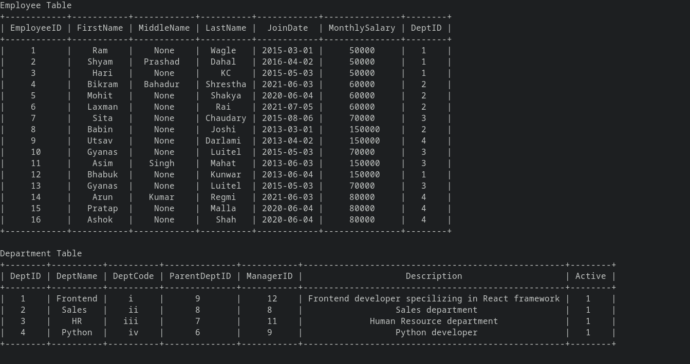
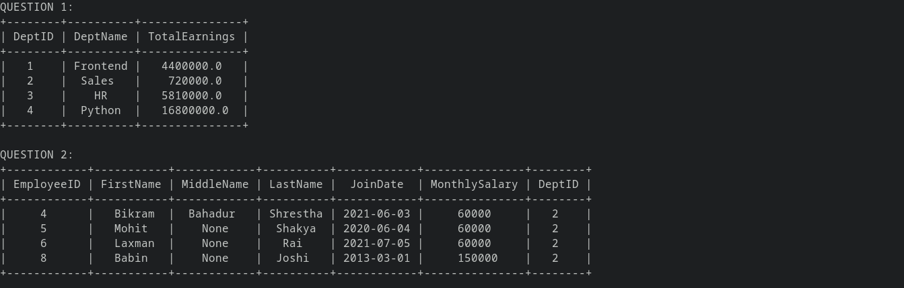
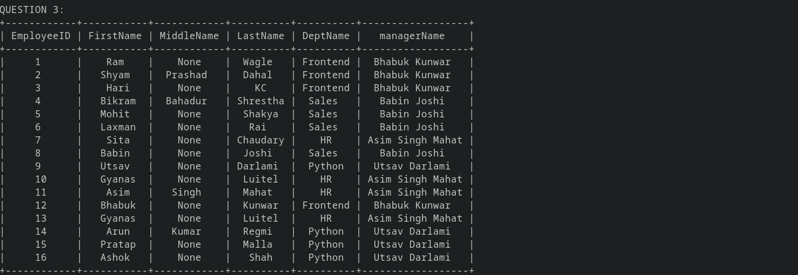

# Database

### Project Structure:

1. `db_init.py` contains the code that creates a database `bajra.db` and adds values to tables created.
2. `main.py` contains SQL queries to display desired outputs.

### To run the project:

1. First install prettytable. It is a simple Python library for easily displaying tabular data in a visually appealing ASCII table format. Install the library via command:
   > python -m pip install -U prettytable
2. Run the following command to initialize the database:
   > python db_init.py
3. Run the following command for desired operations:
   > python main.py

### Results:

The desired output of each step is clearly displayed in the terminal as shown below.

