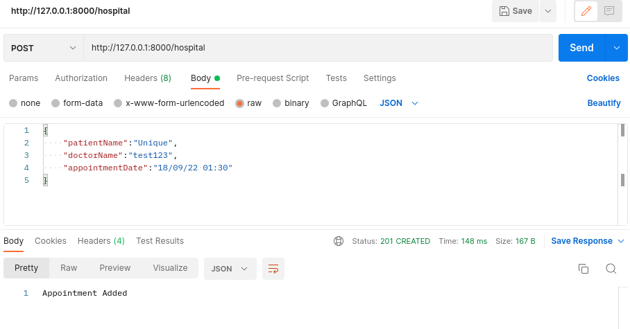
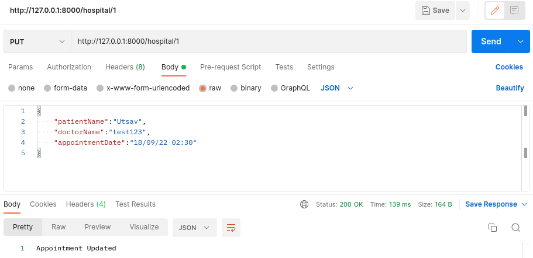
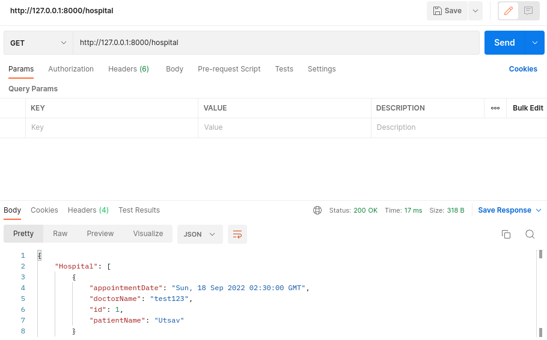
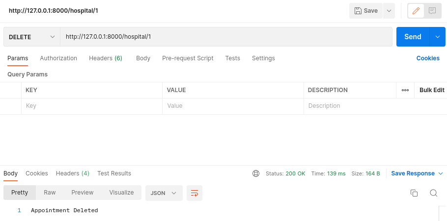

# CRUD application
This project consists of only the backend required to perform the CRUD application. In order to test the APIs use [POSTMAN](https://learning.postman.com/docs/getting-started/introduction/).

### Project Structure:

1. `api.py` contains APIs required.
2. `db_init.py` initializes database.
2. `hospital.py` contains Hospital class and methods that is required to perform required database operations.
3. `settings.py` initializes database.
4. `bajra.db` is the database for the project.
5. `view.py` contains code to view the database in terminal.

### To run the project:

1. First install prettytable, flask, flask-sqlalchemy.
2. Run the following command to host the backend locally:
    > python db_init.py
3. Run the following command to host the backend locally:
    > python api.py

### Results:

The result of each API call from postman is shown below.
1. Added data:

2. Updated data:

3. Viewed data:

4. Deleted data:
